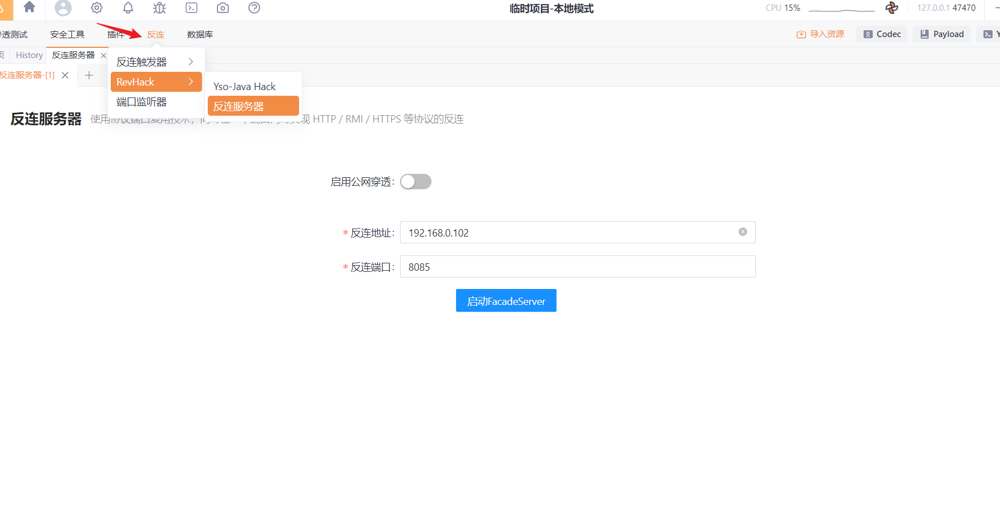
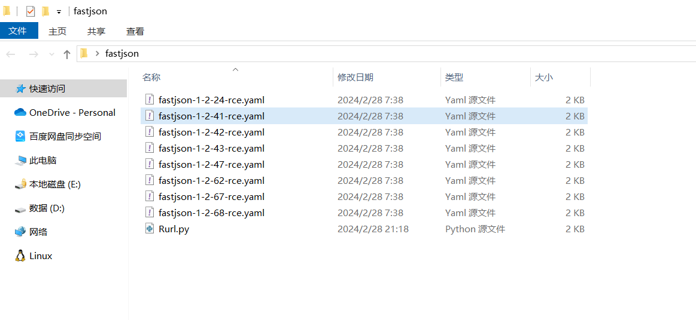
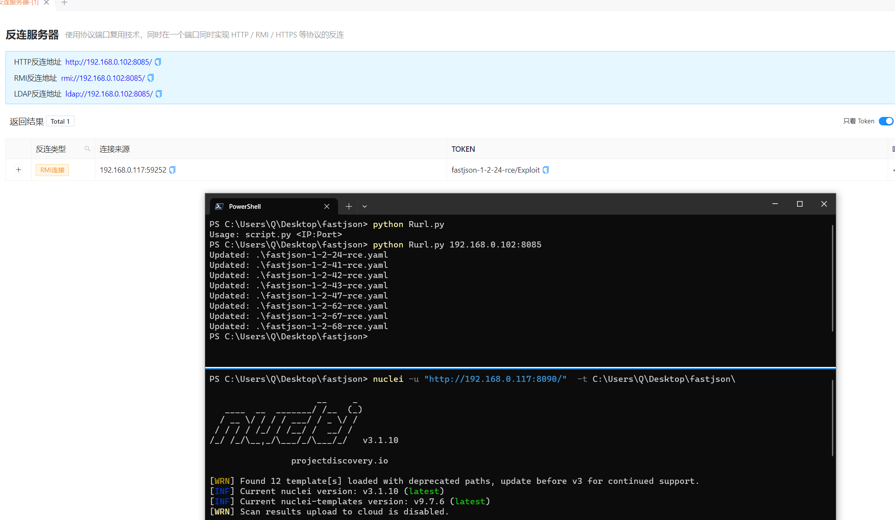

# 批量替换 nuclei 模板中的 内置反链 

**就是替换掉了  yaml 中的 {{interactsh-url}} 占位符**


## 使用yakit自带的反链



将要批量修改的 yaml 与脚本放在同一目录下



## 脚本使用方法 python Rurl.py ip：端口号

 

```bash
nuclei -u "http://192.168.0.117:8090/"  -t C:\Users\Q\Desktop\fastjson\
```

对 http://192.168.0.117:8090 进行内网 fastjson 漏洞检测； -t 指定我们修改后的 yaml 文件夹即可



##  有 go 环境 直接 安装 nuclei

设置国内代理``go env -w GOPROXY=https://goproxy.cn,direct``

```shell
go install -v github.com/projectdiscovery/nuclei/v3/cmd/nuclei@latest
```

